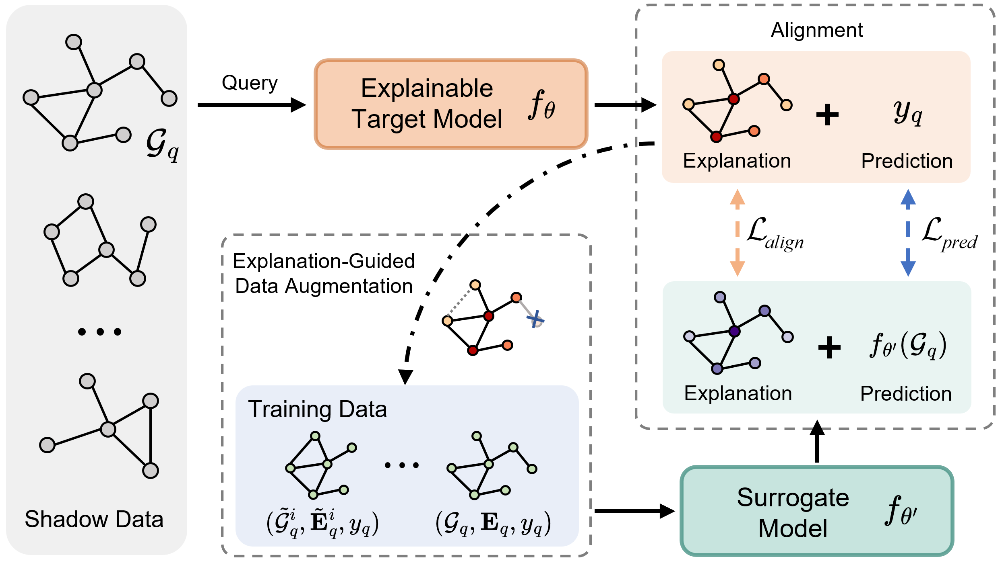

# How Explanations Leak the Decision Logic: Stealing Graph Neural Networks via Explanation Alignment


## Introduction

We propose `EGSteal`, a novel framework that leverages explanations from Graph Neural Networks (GNNs) to reveal their decision logic, enhancing the efficiency of model stealing attack.



## Environment Setup

This project was developed using Python 3.12. To set up the project environment, follow these steps:

1.Create a Conda environment:
```bash
conda create -n egsteal python=3.12
conda activate egsteal
```

2.Install dependencies:
```bash
pip install -r requirements.txt
```


## File Descriptions
Below is a summary of the main Python files and their functionality:


- `data_preparation.py`:  Download and split dataset
- `train_target_model.py`:  Train target model
- `target_model_inference.py`:  Use the trained target model to infer predictions and explanations on shadow data, and generate queried data
- `train_surrogate_model.py`:  Train surrogate model with queried data


## Usage

```bash
python run_experiments.py --dataset_name NCI1
```

### Key Parameters
- `dataset_name`: Name of the dataset (default: 'NCI1', options: 'AIDS', 'NCI1', 'NCI109', 'Mutagenicity')

- `query_sample_ratio`: List of query sample sizes to test (default: [0.1, 0.2, 0.3, 0.4, 0.5])

- `seeds`: Random seeds for experiments (default: [41, 42, 43, 44, 45])

- `explanation_mode`: Explainer of target model (default: 'CAM')


### Full Parameter List
Run `python run_experiments.py --help` for a complete list of parameters and their descriptions.


The script uses a YAML file to configure the settings of the surrogate model, which can be generated using generate_experiment_setting.py. Here is an example YAML structure:

```yaml
settings:
- align_weight: 0.1
  augmentation_ratio: 0.2
  mode_name: aug_0.2_align_0.1
- align_weight: 1
  augmentation_ratio: 0.1
  mode_name: aug_0.1_align_1
```


### Output
- Experiment parameters are saved to `experiment_params/[dataset]_params_[timestamp].json`
- Results are saved to `results/[dataset]_results_[timestamp].json`


